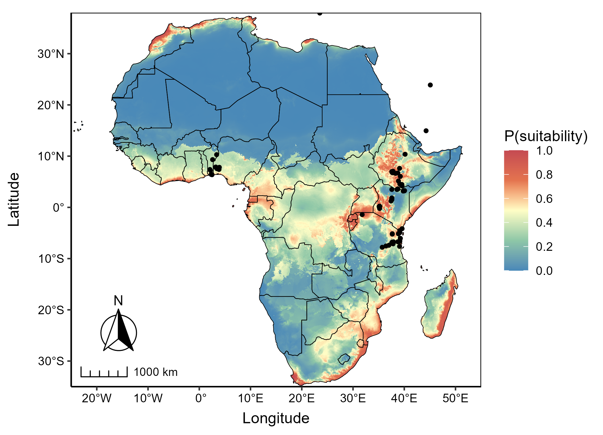

# Honours Species Distribution Modelling 👨‍🎓
*Clarke van Steenderen*    
*Department of Zoology and Entomology, Rhodes University*

This introductory module to Species Distribution Modelling (SDM) will guide you through all the steps needed to create your first prediction models using the popular MaxEnt tool through R. We will use the Asian Citrus Psyllid (*Diaphorina citri*) as a case study, and generate a predictive MaxEnt model based on global climate variables and elevation data. *Diaphorina citri* is a major citrus pest and has caused significant financial losses to citrus industries in many regions; in some cases it has threatened their existence. The psyllid is native to Asia, but has spread across the world. It has been recorded in Africa, but it has not dispersed as far south as South Africa yet.

Here, we will create MaxEnt models to predict which regions of South Africa might be the most climatically suitable for *D. citri*, and how it might enter the country through climatically-suitable routes. We'll go over all the major steps in an SDM analysis, and how to produce attractive maps.

Download this repository by clicking **Code** ➡️ **Download ZIP"**

The main coding file is **sdm_R_code.html** or **sdm_R_code.rmd**

